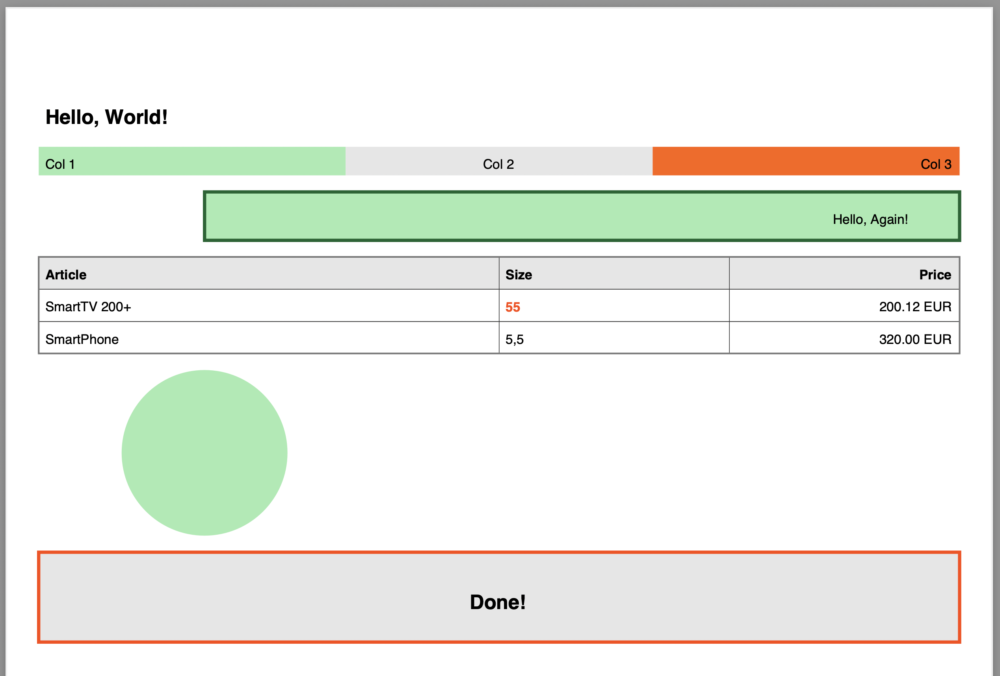

# Unbox PDF

## A PDF toolkit for Java based on PdfBox

This toolkit provides some components that are hopefully helpful to create your custom PDFs with Java.

A lot of concepts are borrowed from HTML, like Margins, Paddings and Borders. 

The following code shows by example how to use this toolkit.


```Java
Document document = new Document();

// add a paragraph
document.render(paragraph("Hello, World!", Align.LEFT, helvetica_bold(12)));

// add a row with several paragraphs
document.render(new Row().with(Margin.of(10,0))
        .add(paragraph("Col 1").with(background(NEON_GREEN)))
        .add(paragraph("Col 2", Align.CENTER).with(background(GRAY_100)))
        .add(paragraph("Col 3", Align.RIGHT).with(background(RED_ORANGE.brighter())))
);

// Add paragraph with background
document.render(paragraph("Hello, Again!", Align.RIGHT)
        .with(Margin.left(100))
        .with(Padding.of(10, 30))
        .with(border(2, UnboxTheme.GREEN))
        .with(background(NEON_GREEN)));

// Add a table with fixed column model
TableModel tableModel = new TableModel()
        .add("Article", 2f)
        .add("Size")
        .add("Price", Align.RIGHT);
Table table = new FixedColumnsTable(tableModel)
        .with(Margin.of(10))
        .with(border(1, GRAY_500));
table.addHeader(TableRow.header(tableModel, helvetica_bold(8)).with(background(GRAY_100)));
table.addRow()
        .addCell("SmartTV 200+")
        .addCell("55", Align.LEFT, helvetica_bold(8, RED_ORANGE))
        .addCell("200.12 EUR");
table.addRow().withCells("SmartPhone", "5,5", "320.00 EUR");
document.render(table);

// render some graphics on a canvas
document.render(new Canvas(100) {
    @Override
    public void paint(PDPageContentStream contentStream, Bounds viewPort) throws IOException {
        drawCircle(contentStream, viewPort.left() + 100, viewPort.top() -50, 50, NEON_GREEN);
    }
}.with(Margin.bottom(10)));

document.render(paragraph("Done!", Align.CENTER, helvetica_bold(12))
        .with(Padding.of(20))
        .with(border(2, RED_ORANGE))
        .with(background(GRAY_100)));

PDDocument pdf = document.finish();
        pdf.save("./samples/out/SimplePdf.pdf");
        pdf.close();
```

The result will look like this:

