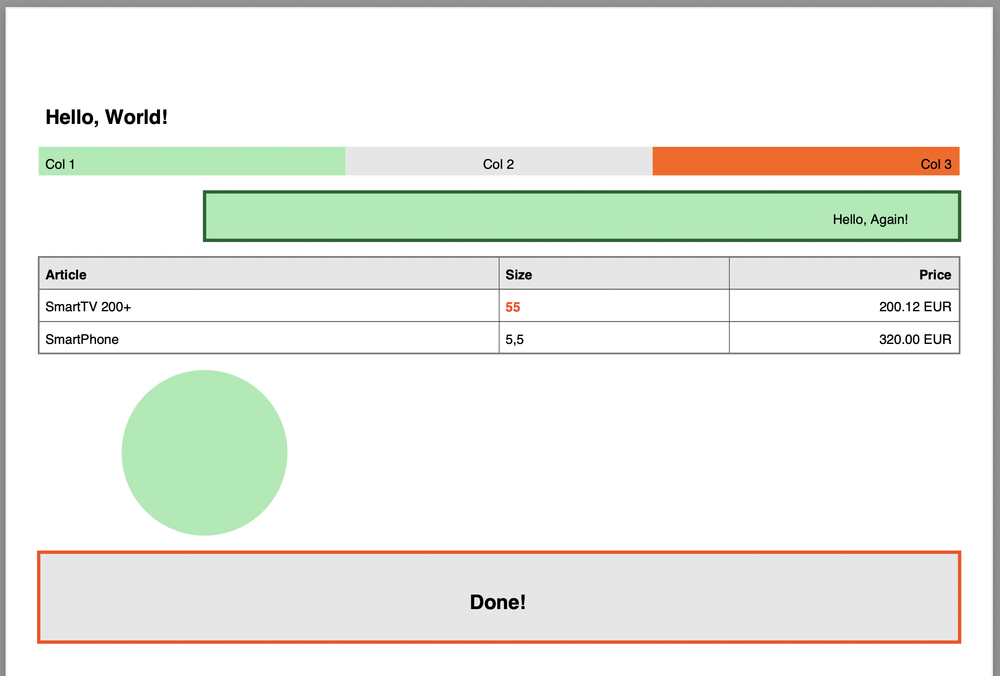

# Unbox PDF

A Java library for creating PDFs with Apache PDFBox. Its fluent API provides
paragraphs, rows, columns, tables, and custom drawing, with HTML-inspired margins,
padding, borders, and backgrounds.

## Build and test

Use a JDK compatible with Java 17. CI uses JDK 21 while the published artifact
remains Java 17-compatible. Maven is provided by the checked-in wrapper.
The current project version is `0.10.0-SNAPSHOT`; the build uses PDFBox 2.0.37.

Run from the repository root:

```bash
./mvnw test
./mvnw package
```

To install the library locally, including for the separate samples project:

```bash
./mvnw -Dgpg.skip install
```

Signing is bound to Maven's `verify` phase. `-Dgpg.skip` allows a local installation
without a signing key; `test` and `package` do not reach that phase.
The wrapper pins Maven 3.9.16 and verifies its distribution checksum. On first
use it downloads Maven into `~/.m2/wrapper/dists/`; subsequent runs reuse it.
Network access is needed for this download and uncached dependencies. No separate
Maven installation is required. On Windows use `mvnw.cmd` instead of `./mvnw`.
The Unix launcher requires a POSIX shell, curl or wget, unzip, and SHA-256 tooling
(`shasum` or `sha256sum`); the Windows launcher uses PowerShell.

After installing locally, another Maven project can use this checkout's version:

```xml
<dependency>
    <groupId>consulting.inspired</groupId>
    <artifactId>unbox-pdf</artifactId>
    <version>0.10.0-SNAPSHOT</version>
</dependency>
```

## Example

The following class creates a PDF in `target/`. Run it with the library and its
PDFBox dependencies on the classpath, for example from a consuming Maven project
in your IDE.

```java
import inspired.pdf.unbox.Align;
import inspired.pdf.unbox.Document;
import inspired.pdf.unbox.Margin;
import inspired.pdf.unbox.Padding;
import inspired.pdf.unbox.base.TableModel;
import inspired.pdf.unbox.elements.FixedColumnsTable;

import java.io.IOException;
import java.nio.file.Files;
import java.nio.file.Path;

import static inspired.pdf.unbox.Unbox.background;
import static inspired.pdf.unbox.Unbox.paragraph;
import static inspired.pdf.unbox.Unbox.row;
import static inspired.pdf.unbox.decorators.BorderDecorator.border;
import static inspired.pdf.unbox.internal.SimpleFont.helvetica_bold;
import static inspired.pdf.unbox.themes.UnboxTheme.GRAY_100;
import static inspired.pdf.unbox.themes.UnboxTheme.GRAY_500;

public class Example {
    public static void main(String[] args) throws IOException {
        Path output = Path.of("target", "example.pdf");
        Files.createDirectories(output.getParent());
        try (Document document = new Document()) {

            document.render(paragraph("Hello, World!", helvetica_bold(12)));
            document.render(row()
                .with(Margin.of(10, 0))
                .add(paragraph("Left"))
                .add(paragraph("Center", Align.CENTER))
                .add(paragraph("Right", Align.RIGHT)));

            TableModel model = new TableModel()
                .add("Article", 2f)
                .add("Size")
                .add("Price", Align.RIGHT);
            FixedColumnsTable table = new FixedColumnsTable(model)
                .withHeader(helvetica_bold(8), background(GRAY_100))
                .with(Margin.of(10))
                .with(border(1, GRAY_500));
            table.addRow().withCells("SmartTV 200+", "55", "200.12 EUR");
            table.addRow().withCells("SmartPhone", "5.5", "320.00 EUR");
            document.render(table);

            document.render(paragraph("Done!", helvetica_bold(12), Align.CENTER)
                .with(Padding.of(10))
                .with(background(GRAY_100)));

            document.finish().save(output.toFile());
        }
    }
}
```

`Document` renders elements from top to bottom. `finish()` returns the PDFBox
`PDDocument`; save it before the try-with-resources block closes `Document` and
its PDF resources. When the PDFBox document is not needed, `finishTo(OutputStream)`,
`finishTo(Path)`, and `finishToBytes()` write the PDF and close the document in
one call. Tables handle page breaks between rows and repeat headers by default.
Arbitrary elements and table rows are not split automatically across pages.
Table lines come from a row stroke and a column stroke. `with(Stroke)` sets both,
`withRowStroke` and `withColumnStroke` set one axis, and `Stroke.none()` switches an
axis off; an outer frame is a border decorator on the table.

The default fonts are the PDFBox standard 14 fonts with `WinAnsiEncoding`. Characters
outside that encoding, such as `Ā`, CJK characters, or emoji, are replaced by a question
mark, so caller data never aborts generation. `SimpleFont.withReplacement(null)` makes
such text fail with a `PdfUnboxException` instead. To render such characters, embed a
TrueType font with `document.loadFont(path)` and use `face.at(size)` or
`face.at(size, color)` as the font; the face is valid for that document only.

### Styled text runs

A paragraph can mix fonts on one line. Appended runs flow and wrap as one text,
and runs on the same line share the baseline:

```java
document.render(paragraph("82 %", helvetica_bold(10))
    .add(" of rated load", new SimpleFont(PDType1Font.HELVETICA, 8, GRAY_600)));
```

### Paragraph overflow

Paragraphs clip excess text by default. To mark truncation with an ellipsis:

```java
paragraph("First\nSecond").limit(1).with(Overflow.ELLIPSIS);
```

Import `inspired.pdf.unbox.Overflow` for this example. The policy also applies to
fixed paragraph heights; `Overflow.OVERFLOW` draws beyond the allocated space.
See the [overflow contract](docs/specs/paragraph-truncation-ellipsis.md) for details
and API migration guidance.

## Samples

`samples/` is a separate Maven project, not a module of the root build. Install
the library first, then compile the examples:

```bash
./mvnw -Dgpg.skip install
./mvnw -f samples/pom.xml package
mkdir -p samples/out
```

Open the samples project in your IDE and run a sample's `main` method with the
repository root as its working directory. Examples include `samples.SimplePdf`,
`samples.MultiPagePdf`, `samples.StretchingColumns`,
`samples.MultiLineSupportForParagraph`, `samples.VerticalText`, and
`samples.FlexTableReport`, which shows a `FlexTable` with a different column
model per row, and `samples.DrawnContentOnTextLine`, which aligns drawn bars and
dots with text lines.
They write to `samples/out/`.

An illustration from an earlier version of the sample:



## Contributing and AI-assisted development

[AGENTS.md](AGENTS.md) contains shared build, coding, and validation instructions
for Codex and Claude Code. [CLAUDE.md](CLAUDE.md) imports that file so both tools use
the same guidance. Maintain shared instructions in `AGENTS.md`.

- [Library principles](docs/specs/library-principles.md): architecture, contracts,
  and extension conventions.
- [Quality audit](docs/plans/quality-audit.md): open rendering, layout, and maintenance tasks.
- [Maven Wrapper setup](docs/plans/maven-wrapper.md): consistent Maven setup for
  contributors and CI.

Put behavior specifications in `docs/specs/` and implementation plans in
`docs/plans/`. Ask before introducing production or test dependencies.

Run `./mvnw test` after Java changes. Document regression tests compare generated PDFs
byte-for-byte with committed references; inspect intentional rendering changes
visually before accepting updated references. Documentation-only changes need
consistency and link checks. The CI workflow runs the tests on JDK 17 and 21 for
pushes to `main` and for pull requests. The publish workflow runs on release
creation and deploys to Maven Central through the Central Portal; the required
secrets are listed in [release publishing](docs/specs/release-publishing.md).

## License

[MIT](LICENSE).
